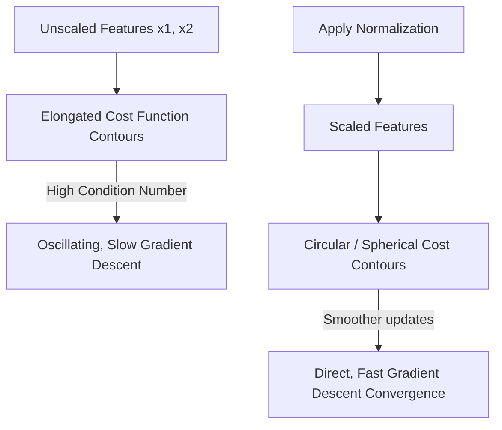

# Feature Scaling and Normalization

When optimizing multi-variable models (such as in multivariate linear regression), the different features often naturally exist on vastly different numerical scales (e.g., house size in sq ft vs. number of bedrooms). 

## The Problem: Oscillating Gradient Descent

If one parameter (like $\theta_1$) changes much more rapidly than another ($\theta_2$) due to extreme differences in scale:
- The resulting cost function contour surfaces become heavily **elongated** or elliptical.
- As Gradient Descent navigates these elongated valleys toward the minimum error, its trajectory suffers from severe **oscillation** (bouncing back and forth across the valley walls).
- Finding the optimum updates becomes computationally difficult and excessively slow.

## The Solution: Normalizing Features

By standardizing and formally scaling the features (via **Normalization**), all values are proportionalized to exist strictly within analogous bounds.

Because the numerical distances are symmetric, the elongated cost contours squash down into predictable, circular (or spherical) shapes. Gradient descent effectively points directly toward the global minimum, leading to **swifter convergence**.

