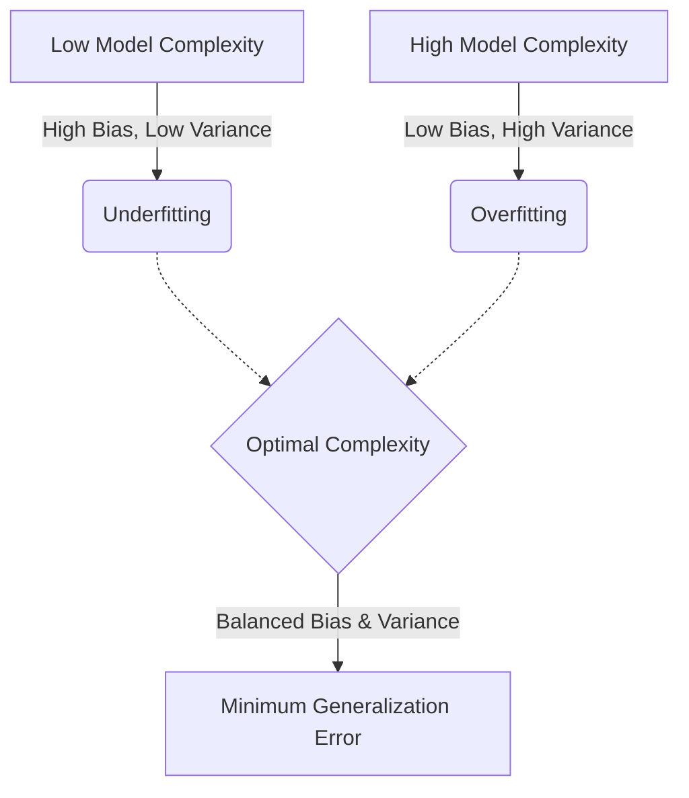

import { Callout } from 'nextra/components';
import OverfittingViz from '@/components/OverfittingViz';

# Overfitting and Underfitting

The ultimate goal of any machine learning model is **generalization**: the ability to perform well on new, unseen data. Two common pitfalls prevent this: **Overfitting** and **Underfitting**.

---

## 1. Underfitting (High Bias)

Underfitting occurs when a model is too simple to capture the underlying structure of the data. 

- **Symptom**: High error on both training and test data.
- **Cause**: The model makes strong, incorrect assumptions (e.g., trying to fit a straight line to data that is clearly curved).
- **Solution**: Increase model complexity, use more features, or reduce regularization.

---

## 2. Overfitting (High Variance)

Overfitting occurs when a model is so complex that it starts "memorizing" the noise in the training data rather than the actual signal.

- **Symptom**: Very low error on training data, but high error on test data.
- **Cause**: The model is too flexible and has too many parameters relative to the amount of data (e.g., using a 10th-degree polynomial to fit 5 points).
- **Solution**: Use more training data, simplify the model (feature selection), or apply **regularization**.

---

## The Goldilocks Zone

We want a model that is "just right"—complex enough to capture the trend, but simple enough to ignore the random noise.

<OverfittingViz />

---
## Signals of Overfitting

| Training Error | Test Error | Status |
| :--- | :--- | :--- |
| High | High | **Underfitting** (Model is too simple) |
| Low | High | **Overfitting** (Model is memorizing noise) |
| Low | Low | **Good Fit** (Model generalizes well) |

---

## Example: Polynomial Degree vs. Validation Error

Suppose we are fitting a model with different polynomial degrees. We measure the average validation error across several runs:

| Degree ($d$) | Validation Error | Status |
| :---: | :---: | :--- |
| 1 | 10.5 | Underfitting (too simple) |
| 2 | 8.7 | Improving fit |
| 3 | **5.6** | **Optimal** (Captures the true trend) |
| 4 | 8.6 | Beginning to overfit |
| 5 | 9.7 | Severe Overfitting (memorizing noise) |

As we increase the degree, the model's flexibility grows. However, after degree 3, the validation error starts to rise because the model begins to capture noise rather than signal.

<Callout type="info">
**The Bias-Variance Tradeoff**: 
The generalization error of a model can be mathematically decomposed as:
$$Err(x) = \text{Bias}^2(x) + \text{Var}(x) + \sigma^2$$
*(where $\sigma^2$ is irreducible error)*

- **Bias** is the error from erroneous assumptions in the learning algorithm. High bias leads to underfitting.
- **Variance** is the error from sensitivity to small fluctuations in the training set. High variance leads to overfitting.

We strive to minimize the sum of both. As we increase model complexity, Bias decreases but Variance increases. This intrinsic inverse relationship requires us to locate the optimal minimum on the generalization error curve.

</Callout>
